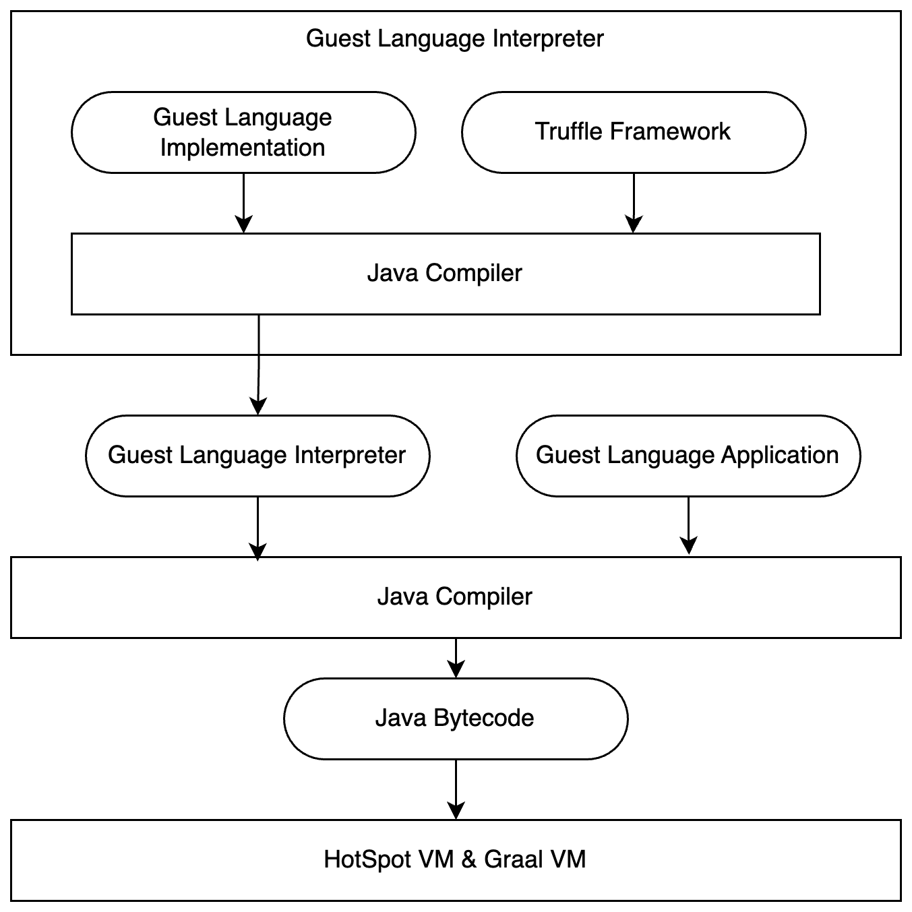
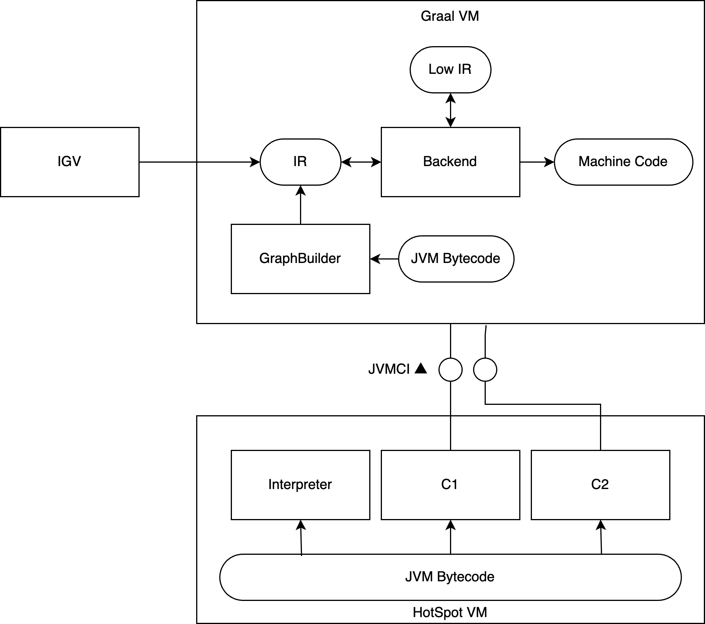

# GraalVM and Truffle

> This document provides an overview of the GraalVM and Truffle framework, including their architecture, features, and used command line options.

## Key Terms

### Java Virtual Machine (JVM)

- The Java Virtual Machine (JVM) is an abstract computing machine enabling a computer to run Java programs.
- It provides a runtime environment in which Java bytecode can be executed.

### JVM Bytecode

- JVM bytecode is the intermediate representation of a Java program that is executed by the JVM.
- It is generated by the Java compiler from the source code.

### Ahead-of-Time (AOT) Compilation

- Ahead-of-Time (AOT) compilation is a process where the source code is compiled into machine code before execution.
- The resulting machine code can be executed directly by the operating system without the need for a JVM [4].

### Just-In-Time Compiler (JIT)

- A Just-In-Time (JIT) compiler is a component of the JVM.
- Compiles section of Java bytecode at interpreter runtime [4,7]

## Truffle Language Implementation

The Truffle Framework allows developers to create interpreters for guest languages that run on GraalVM. You can compile the Guest Language Applications with the Guest Language Implementation to JVM bytecode [2].

The FMC diagram visualizes the Truffle language implementation processing.

### Truffle Framework

- Truffle is a framework, which provides APIs to create language interpreters and compilers.
- The resulting applications run on the GraalVM [1,2,5].

### Guest Language Implementation

- The Guest Language Implementation is the code that defines the semantics and behavior of a specific programming language.
- It is built using the Truffle APIs.

### Guest Language Interpreter

- The Guest Language Interpreter is the runtime component that executes the guest language code.
- It is compiled with a Java compiler from the Guest Language Implementation and the Truffle Framework.
- Given a Guest Language Application, the Guest Language Interpreter executes the code and provides the necessary runtime support for the language features.
  
### Guest Language Application

- The Guest Language Application is the code written in the guest language that is executed by the Guest Language Interpreter.
- It can be any program or script that uses the features of the guest language.

### HotSpotVM and GraalVM

- The HotSpotVM is the Java Virtual Machine that executes the Guest Language Application.
- It uses the GraalVM as a JIT compiler to optimize the execution of the guest language code.
- The GraalVM applies advanced and speculative optimizations to improve performance [1,5].

## GraalVM Compilation Process

Given a JVM bytecode, you can use GraalVM to run and optimize it. The FMC diagram visualizes the JVM mode of GraalVM.

### HotSpotVM

- The HotSpotVM works as Java Virtual Machine (JVM) and executes Java applications using tiered compilation.
- Initially, the interpreter runs the bytecode. As the code becomes "hot," it is compiled first with the client compiler (C1) and later with the server compiler (C2) [7].

### Java Virtual Machine Compiler Interface (JVMCI)

- The JVMCI is an API that allows any compiler to be used as a JIT compiler for C1 and C2.
- This enables the integration of Graal's advanced optimization techniques into the JVM [5,7].

### GraalVM

- GraalVM is a high-performance runtime that includes a JIT compiler for optimizing Java bytecode [1,5].
- It applies advanced and speculative optimizations.

### GraphBuilder

- The GraphBuilder is a component of the GraalVM that constructs from the JVM bytecode an intermediate representation (IR).
- Other components of the GraalVM use this IR for further optimization and code generation [5].

### GraalVM Backend

- The GraalVM backend is responsible for generating machine code from the IR produced by the GraphBuilder.
- It applies various optimizations to produce efficient native code.
- It uses the Low Intermediate Representation (Low IR) to represent the code in a form that is closer to machine code [1,5].

### Ideal Graph Visualizer (IGV)

- The IGV is a tool that allows developers to visualize the IR of the code during different phases of the compilation process.
- It provides insights into how the GraalVM optimizes the code and helps in debugging and performance tuning [3].

Besides the JVM mode, GraalVM also supports the Native Image mode, which allows you to compile Java applications into native executables [4].

## Examples

In our project, we implemented Squeak / Smalltalk as a guest language using the Truffle framework. An image is the guest language application that is executed by the Guest Language Interpreter [2,6].  

## Resources

- [1] [GraalVM Documentation](https://www.graalvm.org/latest/docs/)
- [2] [Truffle Documentation](https://www.graalvm.org/latest/graalvm-as-a-platform/language-implementation-framework/)
- [3] [GraalVM IGV Documentation](https://www.graalvm.org/latest/docs/reference-manual/igv/)
- [4] [AOT mode vs JIT mode](https://www.oracle.com/a/ocom/docs/graalvm-enterprise-product-architecture.pdf)
- [5] [One VM to Rule Them All, Wurthinger, 2013](https://www.researchgate.net/publication/262170315_One_VM_to_rule_them_all)
- [6] [Exploratory tool-building platforms for polyglot virtual machines, Niephaus, 2022](https://publishup.uni-potsdam.de/frontdoor/index/index/docId/57177)
- [7] [Deep Dive Into the New Java JIT Compiler – Graal](https://www.baeldung.com/graal-java-jit-compiler)
