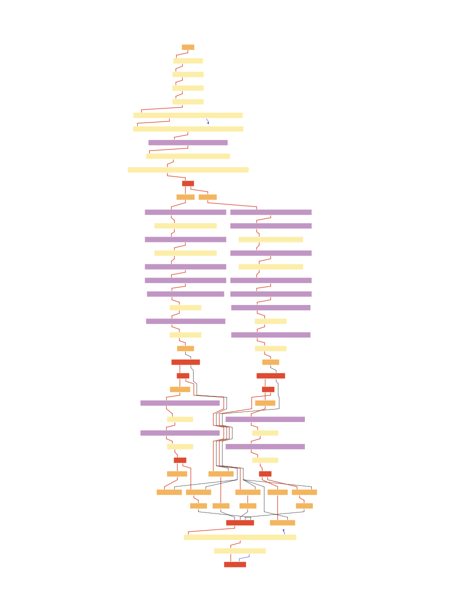
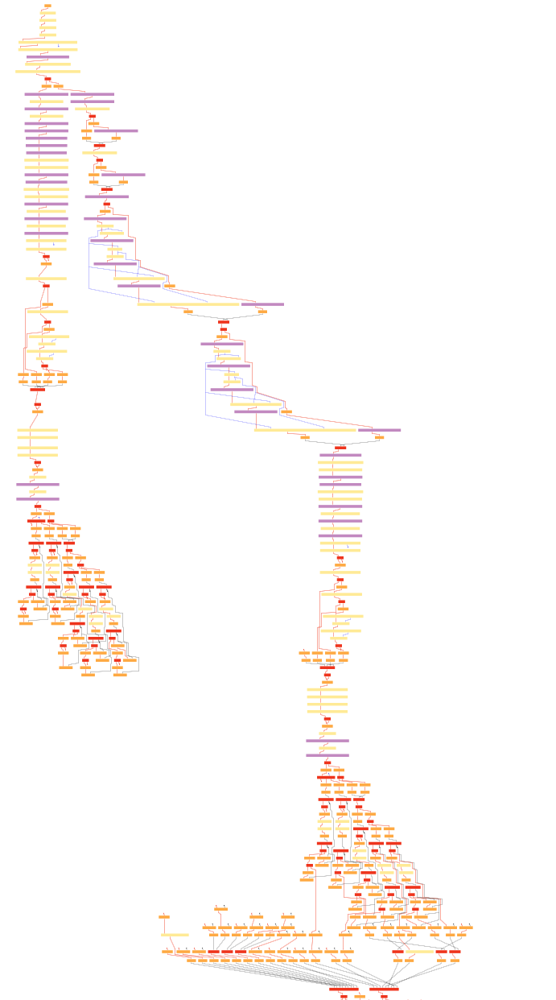

# TruffleString Experiment

> This document outlines the experiments conducted with the TruffleString class, including performance benchmarks, memory usage analysis, and other relevant findings.

## 1. Introduction

### 1.1 Background
<!-- How primitives and non primitives are represented -->
<!-- TruffleString class and its role in the Truffle framework -->

TruffleSqueak is a Squeak implementation on the GraalVM Truffle framework. It aims to leverage the performance and language interoperability benefits of Truffle while maintaining compatibility with Squeak's features. Each Squeak object is represented as a Java object.

This experiment focuses on the data representation of Smalltalk objects in Java. We differentiate between primitives (i.e. `ClassObject`) and non-primitives (i.e. `ByteString`, `ByteArray`, etc.). Primitive classes have a direct mapping to Java classes.


Non-primitive classes are represented by Java objects of the class `NativeObject` that encapsulate the data. Each `NativeObject` instance contains a `storage` and `class` object. The `storage` contains the actual data, while the `class` object provides metadata about the object type. Different non-primitive classes have different storage types, such as `WideString` uses `int[]` and `ByteString` uses `byte[]`.


We want to investigate if we can improve the performance of string operations by leveraging tools provided by the Truffle framework.

### 1.2 Baseline Performance
<!-- JSON Benchmark -->
<!-- Run on Antonys Computer -->
<!-- Results -->

To compare the performance of string operations, we decided to use the `JSON Benchmark` from the "Are We Fast Yet?" framework, because it includes allot of string operations. We measure the time needed to parse 100 JSON strings and convert them into a Smalltalk object. We run the benchmark 300 times to ensure consistent results and to account for any warm-up effects.

The command to run the benchmark is as follows:

```bash
trufflesqueak --experimental-options --smalltalk.disable-startup --smalltalk.disable-interrupts --engine.Mode=default --code "AWFYHarness run: #('Json' 300 100)"
```

We run the benchmark on a machine with the following specifications:

- Apple MacBook Pro 2023
- Chip: Apple M3 Pro
- Memory: 16GB
- Operating System: macOS Sequoia 15.4

The results of the benchmark are as follows:

| Metric       | Baseline (ms) |
| ------------ | ------------- |
| Average Time | 201 ms        |
| Minimum Time | 173 ms        |
| Maximum Time | 1 532 ms      |
| Summary Time | 60 440 ms     |

### 1.3 Experiment Goals
<!-- Improved performance for string operations -->
<!-- Sideproduct: Improved interoperability with other languages -->

Truffle offers a specialized string class called `TruffleString`, designed to optimize string operations and enhance performance through vector representation and parallelism.

The goal is to explore how the Truffle framework can optimize string operations and improve performance by leveraging the capabilities of the `TruffleString` class.

We expect to achieve the following:

- Improved runtime performance for string operations.
- Enhanced interoperability with other languages supported by GraalVM.

## 2. Experiment 1: Replace ByteStrings with TruffleString

### 2.1 Implementation

<!-- Changed storage of ByteStrings to TruffleString -->
In the first experiment, we replaced the `byte[]` storage of `ByteString` with `TruffleString`. With that change, we replaced byte operations with TruffleString operations.

### 2.2 Results

<!-- Performance decreased -->

We ran the JSON benchmark again with the modified implementation. The command to run the benchmark remains the same.
Let's compare the results of the first experiment with the baseline performance:

| Metric       | Baseline (ms) | Experiment 1 (ms) | Change (%) |
| ------------ | ------------- | ----------------- | ---------- |
| Average Time | 201 ms        | 327 ms            | +62.4% ⬆️   |
| Minimum Time | 173 ms        | 291 ms            | +68.3% ⬆️   |
| Maximum Time | 1 532 ms      | 2 883 ms          | +88.1% ⬆️   |
| Summary Time | 60 440 ms     | 98 142 ms         | +62.3% ⬆️   |

We can see that the performance of the first experiment decreased compared to the baseline. The average time increased from 201 ms to 327 ms, and the maximum time increased significantly from 1 532 ms to 2 883 ms.

### 2.3 Discussion

<!-- Issue: Provide for each permutation of string types a separate method to avoid the overhead of type checks -->
<!-- Reduce permutation by replacing ByteArrays with TruffleString -->

The significant performance degradation (62.4% increase in average time) requires investigation to understand the root causes and identify potential improvements for the next experiment. To investigate the performance degradation, we analyzed the compiler's behavior using:

- **Compilation statistics** [2] to measure overall compilation time and code size
- **Compilation trace logs** [2] to analyze the compilation process of methods
- **LCTLCT (Legendary compilation trace log comparison tool)** [1] to compare compilation statistics and compilation traces between versions
- **IGV (Ideal Graph Visualizer)** [3] to visualize compilation optimization steps

The following table summarizes the compilation statistics for the first experiment compared to the baseline performance:

| Metric           | Tier | Baseline      | Experiment 1  | Change (%) |
| ---------------- | ---- | ------------- | ------------- | ---------- |
| Compilation Time | 1    | 6 948 955 ms  | 8 333 508 ms  | +21% ⬆️     |
| Compilation Time | 2    | 10 044 058 ms | 21 799 170 ms | +117% ⬆️    |
| Code Size        | 1    | 304 688 bytes | 325 563 bytes | +6% ⬆️      |
| Code Size        | 2    | 742 502 bytes | 946 422 bytes | +27% ⬆️     |

The compilation statistics show that the code size increased significantly in the first experiment. The compilation time also increased, which indicates that the compiler had to do more work to optimize the code. Larger code size and longer compilation time can lead to slower runtime performance, as the compiler has to spend more time optimizing the code.

Given the increased compilation time and code size, we want to improve it in the next experiment by identifying the causes of the performance degradation. We identified with the trace compilation logs and LCTLCT that the code size of the string comparison method `String>>#compareWith:` increased.

The following table summarizes the code size of the `String>>#compareWith:` method for the baseline performance and the first experiment:

| Metric    | Tier | Baseline    | Experiment 1 | Change (%) |
| --------- | ---- | ----------- | ------------ | ---------- |
| Code Size | 1    | 2 040 bytes | 10 840 bytes | +433% ⬆️    |
| Code Size | 2    | 897 bytes   | 6 839 bytes  | +664% ⬆️    |

This indicates that the method was significantly larger in the first experiment, which likely contributed to the performance degradation. With the help of the IGV, we could see that the method was not optimized well, leading to a larger code size and slower performance.

The following pictures visualize the compilation graphs of the `String>>#compareWith:` method, showing the increased complexity in Experiment 1. The first image shows the compilation graph for the baseline performance, while the second image shows the compilation graph for the first experiment:






The compilation steps diagram and the implementation of `String>>#compareWith:` shows, that the method increased, because we need to compare different types of strings now. The `String>>#compareWith:` method must handle all possible combinations of string types. In the baseline version, string comparisons involved these types:

**Baseline (2 storage types):**

- `ByteStrings`, `ByteSymbols` and `ByteArrays` (when used as strings): `byte[]` storage
- `WideStrings`: `int[]` storage

**Experiment 1 (3 storage types):**

- `ByteStrings`: `TruffleString` storage
- `WideStrings`: `int[]` storage  
- `ByteSymbols` and `ByteArrays` (when used as strings): `byte[]` storage

This increases the number of type permutations the compiler must optimize. For string comparison operations, the compiler must generate optimized code paths for each possible combination:

**Baseline permutations (3 combinations):**

- `byte[]` vs `byte[]`
- `int[]` vs `int[]`
- `byte[]` vs `int[]`

**Experiment 1 permutations (6 combinations):**

- `TruffleString` vs `TruffleString`
- `TruffleString` vs `byte[]`
- `TruffleString` vs `int[]`
- `byte[]` vs `byte[]`
- `byte[]` vs `int[]`
- `int[]` vs `int[]`

This leads to a larger code size and slower performance, as the compiler has to generate more code for each permutation.
We can reduce the code size by replacing `ByteArrays` and `ByteSymbols` with `TruffleString`, because this reduces the number of permutations we have to provide methods for. This is the focus of the next experiment.

## 3. Experiment 2: Replace ByteArray and ByteSymbols with TruffleString

### 3.1 Implementation

<!-- Changed storage of ByteArray to TruffleString -->

In the second experiment, we extended the implementation of the first experiment. We also replaced the `byte[]` storage of `ByteArray` and `ByteSymbol` with `TruffleString` and used the same TruffleString operations as in the first experiment on `ByteArray`.

### 3.2 Results

<!-- Performance improved to v1 -->
Let's compare the results of the second experiment with the baseline performance and the first experiment:

| Metric       | Baseline (ms) | Experiment 1 (ms) | Experiment 2 (ms) | Change (%) |
| ------------ | ------------- | ----------------- | ----------------- | ---------- |
| Average Time | 201 ms        | 327 ms            | 292.2 ms          | -10.7% ⬇️   |
| Minimum Time | 173 ms        | 291 ms            | 261 ms            | -10.3% ⬇️   |
| Maximum Time | 1 532 ms      | 2 883 ms          | 2 393 ms          | -16.9% ⬇️   |
| Summary Time | 60 440 ms     | 98 142 ms         | 87 660 ms         | -10.7% ⬇️   |

We can see that the performance of the second experiment improved compared to the first experiment. The average time decreased from 327 ms to 292.2 ms, and the maximum time decreased from 2 883 ms to 2 393 ms.

In comparison to the baseline performance, the second experiment still shows a performance decrease, but it is an improvement over the first experiment.

### 3.3 Discussion

<!-- Codesize decreased to v1 -->

<!-- Performance decreased compared to original -->
<!-- Compilation time and code size of string comparisons decreased -->

<!-- Issue: Cannot use cool TruffleString features like substring, indexOf, etc. -->
<!-- Only use byte wise operations (read & write) because squeak does the operation by it self -->
<!-- Vector representation only make sense for big strings -->

<!-- Micro benchmark: -->
<!-- Improved performance for big strings -->

<!-- Idea: Would have to add (failing for OSVM) primitives to higher level functions to use the TruffleString features -->
<!-- Slow for OSVM -->

## 4. Summary

<!-- Not fast now -->
<!-- TruffleString is optimized for big strings and big operations -->
We replaced in the first experiment the `ByteString` storage with `TruffleString`, which resulted in a performance decrease in the benchmark compared to the baseline performance by 62.4%. In the second experiment, we extended the implementation to also replace the `ByteArray` storage with `TruffleString`, which improved the performance compared to the first experiment by 10.7% but still did not reach the baseline performance.

Reason for the performance decrease is that the `TruffleString` class is optimized for complex string operations that benefit from vector representation and parallelism. The current implementation of `TruffleString` does not leverage these optimizations effectively, because it uses simple byte-wise operations instead of more complex string operations. This is because of the atomicity of the existing Squeak primitives.

## 5. Future Work

<!-- Idea: Would have to add (failing for OSVM) primitives to higher level functions to use the TruffleString features -->

To fully leverage the capabilities of `TruffleString`, we would need to add higher-level primitives that utilize the advanced features of `TruffleString`, such as substring operations, indexOf, and other string manipulations. This would allow us to take advantage of the performance benefits provided by the Truffle framework.
